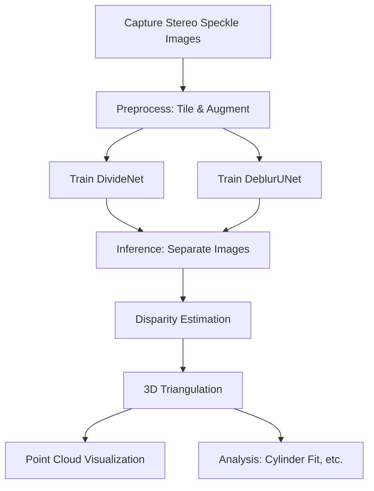

# Speckle-Based Stereo 3D Reconstruction with Deep Learning DIC

[](https://www.python.org/)
[](https://pytorch.org/)
[](LICENSE)

A hybrid **Digital Image Correlation (DIC)** and **deep learning** system for speckle-based stereoscopic 3D reconstruction. This project combines traditional subset-based DIC algorithms with neural networks (DivideNet, DeblurUNet, StrainNet) to perform:

- **Separation** of mixed speckle images (clear + blurred components)
- **Deblurring** of speckle patterns
- **Disparity / Optical Flow** estimation via deep learning or traditional methods
- **3D Reconstruction** via stereo triangulation into point clouds
- **Visualization** of depth-colored point clouds

---

## Project Overview

```
Input:  Mixed speckle stereo images (Left / Right)
        │
        ▼
┌──────────────────────────────┐
│  1. Image Separation         │  DivideNet (clear + blurred)
│     (Optional: Deblurring)   │  DeblurUNet
└──────────┬───────────────────┘
           ▼
┌──────────────────────────────┐
│  2. Disparity / Flow         │  StrainNet / ICGN-DIC / SGBM / TV-L1 / SIFT
│     Estimation               │
└──────────┬───────────────────┘
           ▼
┌──────────────────────────────┐
│  3. 3D Triangulation         │  Stereo triangulation with calibrated cameras
└──────────┬───────────────────┘
           ▼
Output: 3D Point Cloud (.xyz / .ply / .obj)
```

---

## Repository Structure

```
├── main_reconstruction_pipeline.py   # 🚀 End-to-end reconstruction pipeline
├── requirements.txt                  # Python dependencies
├── .gitignore                        # Ignored data/checkpoint directories
│
├── models/                           # Neural network model definitions
│   ├── self_model.py                 # DivideNet (V1-V4) & DeblurUNet
│   ├── StrainNetF.py                 # StrainNet optical flow model
│   ├── util.py                       # Model utility layers
│   └── __init__.py
│
├── train_divide.py                   # Train DivideNet (speckle separation)
├── train_debrurring.py               # Train DeblurUNet (deblurring)
├── test_divide.py                    # Test/inference with DivideNet
├── test_debrurring.py                # Test/inference with DeblurUNet
├── reconstruct_large_image.py        # Reconstruct large images from tiled inference
│
├── StrainNet_inference.py            # StrainNet inference script
├── ICGN_Style_DIC.py                 # Traditional subset-based DIC (IC-GN style)
├── SGBM_2D_DIC.py                    # Semi-Global Block Matching for DIC
├── Pyramidal LK.py                   # Pyramidal Lucas-Kanade optical flow
├── optical_flow_tvl1.py              # TV-L1 optical flow
├── sift.py                           # SIFT feature matching
├── opencv.py                         # OpenCV-based matching utilities
│
├── 2DTrans3D.py                      # 2D disparity → 3D point cloud reconstruction
├── fix_disparity_for_dic.py          # Disparity post-processing and refinement
├── DIC_keshihua.py                   # DIC result visualization (CSV → colored PLY)
├── xyz_visual.py                     # XYZ point cloud visualization
├── yuanzhu_r_calculate.py            # Cylinder radius calculation from point cloud
├── analyse.py                        # Analysis and statistics utilities
│
├── Script_flow.m                     # MATLAB optical flow script
│
└── README.md                         # This file
```

---

## Requirements

### Python & Dependencies

- Python 3.8+
- PyTorch 2.0.1 (CUDA recommended)
- See [requirements.txt](requirements.txt) for the full list:

```bash
pip install -r requirements.txt
```

If you have a CUDA-capable GPU, install the matching PyTorch version from [pytorch.org](https://pytorch.org/).

**Key dependencies:**
| Package | Version | Purpose |
|---|---|---|
| torch | 2.0.1 | Deep learning framework |
| torchvision | 0.15.2 | Image transforms & datasets |
| opencv-python | 4.13.0 | Image processing & triangulation |
| open3d | 0.19.0 | 3D point cloud visualization |
| numpy | 1.26.4 | Numerical computing |
| scipy | 1.15.3 | Signal/image filtering |
| scikit-image | 0.25.2 | Image processing utilities |
| matplotlib | 3.10.9 | Visualization & color mapping |
| Pillow | 12.1.1 | Image I/O |
| pandas | 2.3.3 | CSV data handling |
| tqdm | 4.67.3 | Progress bars |
| imageio | 2.37.3 | Image/volume I/O |
| pyransac3d | 0.6.0 | RANSAC-based 3D fitting |

### Hardware

- **GPU** (recommended): CUDA-compatible GPU for model training and inference
- **CPU**: Fallback mode supported (slower for neural network inference)
- **Camera**: Stereo camera setup for capturing speckle images

---

## Quick Start

### 1. Clone & Install

```bash
git clone https://github.com/your-username/your-repo.git
cd your-repo
pip install -r requirements.txt
```

### 2. Prepare Data

Place your speckle stereo images in the appropriate directories:

| Directory (gitignored) | Content |
|---|---|
| `bishe_Divide_photoes/` | Mixed speckle images for DivideNet |
| `bishe_DivideNet_photoes_Preprocessing/` | Preprocessed tiles for DivideNet |
| `bishe_Deblurring_photoes/` | Blurry/sharp pairs for DeblurUNet |
| `bishe_DeblurringNet_Preprocessing/` | Preprocessed tiles for DeblurUNet |
| `2DTrans3D_photoes/` | Stereo image pairs for 3D reconstruction |
| `checkpoints/` | Store pretrained model weights |

### 3. Download or Train Models

**Option A: Use pretrained weights** (place in `checkpoints/`)

```bash
checkpoints/
├── V4_UNet_Final/best_model_v4.pth      # DivideNet V4 (speckle separation)
├── StrainNet-f.pth.tar                   # StrainNet (optical flow)
├── V3_Final/best_model_v3.pth            # DivideNet V3
├── Deblur_V1/best_deblur_model.pth       # DeblurUNet
```

**Option B: Train from scratch**

```bash
# Train DivideNet to separate mixed speckle images
python train_divide.py

# Train DeblurUNet for speckle deblurring
python train_debrurring.py
```

### 4. Run the Main Reconstruction Pipeline

```python
python main_reconstruction_pipeline.py
```

This performs end-to-end 3D reconstruction:
1. Loads stereo image pair
2. Separates images into clear/blur components (DivideNet)
3. Computes disparity field (StrainNet)
4. Triangulates to 3D point cloud
5. Saves the result as `output_cloud.obj`

### 5. Alternative Methods

```bash
# Traditional subset-based DIC
python ICGN_Style_DIC.py

# SGBM-based disparity
python SGBM_2D_DIC.py

# Optical flow (TV-L1)
python optical_flow_tvl1.py

# SIFT-based feature matching
python sift.py

# Pyramidal Lucas-Kanade
python "Pyramidal LK.py"
```

### 6. Visualize Results

```bash
# Convert DIC results (CSV) to colored point cloud
python DIC_keshihua.py

# Visualize XYZ point cloud
python xyz_visual.py

# Calculate cylinder radius from reconstructed point cloud
python yuanzhu_r_calculate.py
```

---

## Key Modules

### DivideNet (Speckle Separation)

Separates a mixed speckle image (clear + blurred superimposed) into its two components. Available versions:

| Version | Architecture | Description |
|---|---|---|
| V1 | Shared encoder + dual decoder | Basic separation |
| V2 | UNet-style with skip connections | Improved edge preservation |
| V3 | Dual encoders + dual decoders | Better separation quality |
| V4 | (self_model.py: `DivideNet_V4`) | Latest version |

**Training data format:**
- Mixed images: `{id}_blended.png`
- Clear component: `{id}_clear.png`
- Blurred component: `{id}_blurred.png`

### DeblurUNet

UNet-based image deblurring for speckle patterns.

**Training data format:**
- Blurred input: `{name}_blurred.png`
- Sharp target: `{name}_sharp.png`

### StrainNet

Optical flow network adapted for DIC disparity estimation. It predicts a 2-channel dense displacement field (u, v) between image pairs. Architecture based on FlowNet/SpyNet with multiple prediction layers.

### 2D → 3D Reconstruction

The `2DTrans3D.py` script processes a disparity field through:

1. **Median deviation filtering** — removes isolated outlier pixels
2. **Bilateral filtering** — smooths disparity while preserving edges
3. **ROI margin cropping** — removes boundary artifacts
4. **Undistortion** — corrects lens distortion using calibration parameters
5. **Triangulation** — computes 3D coordinates from stereo correspondences
6. **Statistical outlier removal (SOR)** — removes spurious 3D points
7. **Depth range filtering** — keeps points within valid depth range

---

## Camera Calibration

The pipeline requires pre-calibrated stereo camera parameters:

- **Intrinsic matrices** (K1, K2) for each camera
- **Distortion coefficients** (dist1, dist2)
- **Extrinsic parameters** (rotation R, translation T) between cameras

Calibration can be performed using OpenCV's chessboard calibration tools. Example calibration parameters are provided in `2DTrans3D.py` and `main_reconstruction_pipeline.py`.

```
Camera Setup:
   Left Camera ──── baseline ──── Right Camera
        │                            │
   (Reference)                  (Target)
   P1 = K1 [ I | 0 ]          P2 = K2 [ R | T ]
```

---

## Project Workflow Examples

### Full Pipeline (Training + Reconstruction)



### Data Preprocessing

1. Capture stereo speckle images using your calibrated stereo camera
2. (Optional) Tile large images into 256×256 patches
3. Name files according to the expected naming conventions
4. Place data in the appropriate directories

---

## Configuration Notes

All scripts contain hard-coded paths. Before running, update the following:

- **`main_reconstruction_pipeline.py`**: Model checkpoint paths, camera intrinsics, image path
- **`train_divide.py`**: Data directory, save directory for checkpoints
- **`train_debrurring.py`**: Data directory, save directory for checkpoints
- **`2DTrans3D.py`**: Camera calibration parameters, data & output paths
- **`ICGN_Style_DIC.py`**: Image paths, subset/search parameters

**Key parameters in scripts:**
- `SUBSET_SIZE` — DIC subset window size (ICGN_Style_DIC.py)
- `STEP_SIZE` — Grid step size for DIC computation
- `SEARCH_MARGIN` — Search range in the target image
- `tile_size` / `stride` — Image tiling parameters (256 recommended)
- `device` — `'cuda'` or `'cpu'`

---

## Results

The pipeline outputs:
- **3D point cloud files**: `.xyz`, `.obj`, or `.ply` formats
- **Colored point clouds**: Depth-mapped color visualization (via `DIC_keshihua.py`)
- **Disparity maps**: Numpy arrays (`.npy`) and visualizations (`.png`)
- **Separated images**: Clear and blurred components after DivideNet inference

---

## Troubleshooting

| Issue | Likely Cause | Solution |
|---|---|---|
| CUDA out of memory | Batch size too large | Reduce batch size in training scripts |
| No points in output | Incorrect calibration parameters | Verify camera intrinsics and extrinsics |
| Poor disparity results | Domain gap in training data | Fine-tune StrainNet on your speckle patterns |
| DivideNet fails to separate | Model not trained for your pattern | Collect training data specific to your setup |
| "Module not found" | Missing dependencies | `pip install -r requirements.txt` |
| Path errors | Hard-coded paths need update | Search and replace paths for your environment |

---

## Citation

If you use this code in your research, please consider citing:

```bibtex
@software{speckle-dic-3d,
  author = {Yu Wenhao},
  title = {Speckle-Based Stereo 3D Reconstruction with Deep Learning DIC},
  year = {2025},
  description = {Hybrid DIC and deep learning system for speckle-based 3D reconstruction}
}
```

---

## License

This project is for academic and research purposes.

---

## Related Resources

- [Digital Image Correlation (DIC)](https://en.wikipedia.org/wiki/Digital_image_correlation) — Wikipedia
- [StrainNet](https://github.com/jyang526843/StrainNet) — Original StrainNet paper & code
- [Open3D](http://www.open3d.org/) — 3D point cloud library
- [PyTorch](https://pytorch.org/) — Deep learning framework

---

## 中文说明

本仓库是一个基于**数字图像相关 (DIC)** 和**深度学习**的散斑立体视觉三维重建系统，包含以下功能：

| 模块 | 说明 |
|---|---|
| **DivideNet** | 将混合散斑图分离为清晰和模糊分量 |
| **DeblurUNet** | UNet 去模糊网络 |
| **StrainNet** | 光流/视差估计网络 |
| **传统 DIC** | 基于子集迭代匹配的 SIFT 算法 |
| **三维重建** | 双目三角化生成三维点云 |
| **可视化分析** | 点云上色、圆柱拟合、数据分析 |

### 使用步骤

1. **安装依赖**：`pip install -r requirements.txt`
2. **准备数据**：将散斑图像放入对应目录
3. **训练或下载模型**：训练 DivideNet / DeblurUNet，或直接下载预训练权重
4. **运行重建**：执行 `main_reconstruction_pipeline.py` 或 `2DTrans3D.py`
5. **可视化**：使用 `DIC_keshihua.py` 生成彩色点云

> 注意：所有脚本中包含硬编码路径，使用前请按你的环境修改。

---

*Built for academic research on speckle-based 3D measurement and digital image correlation.*
